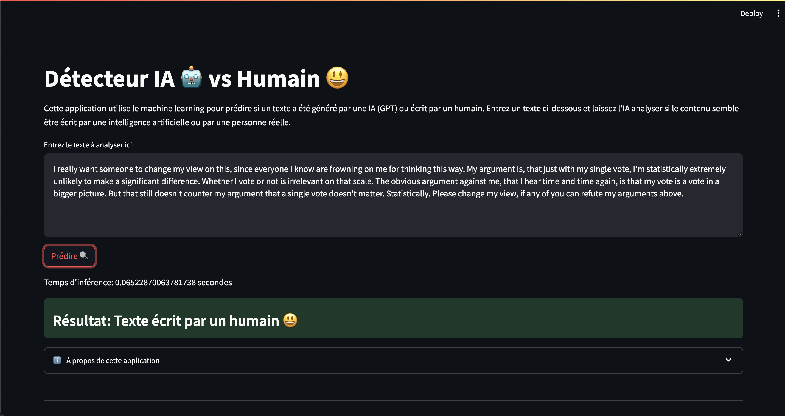

# IA-DATA-HACK



Ce projet contient notre solution au challenge **IA vs AI** du hackaton **IA-DATA-HACK**.<br><br>
Pour exécuter notre solution, il faut exécuter les commandes suivantes dans un terminal :

```shell
foo@bar:~$ python -m venv env
foo@bar:~$ source env/bin/activate
(env) foo@bar:~$ pip install -r requirements.txt
foo@bar:~$ python final_model.py
foo@bar:~$ streamlit run app.py 
```

Lorsque vous avez installé les dépendances, vous pouvez run le notebook en choisissant bien l'environnement python que vous venez de créer, et voilà !
